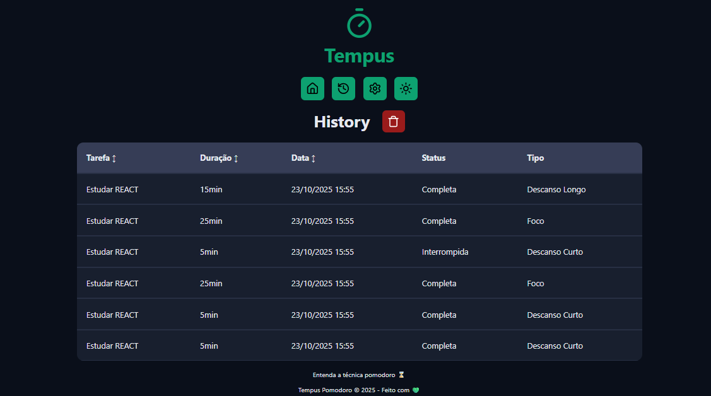
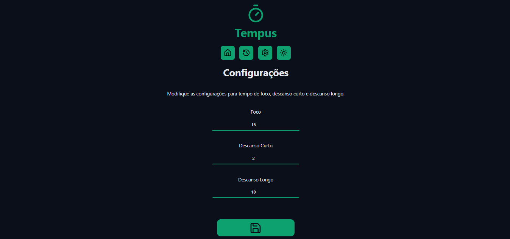
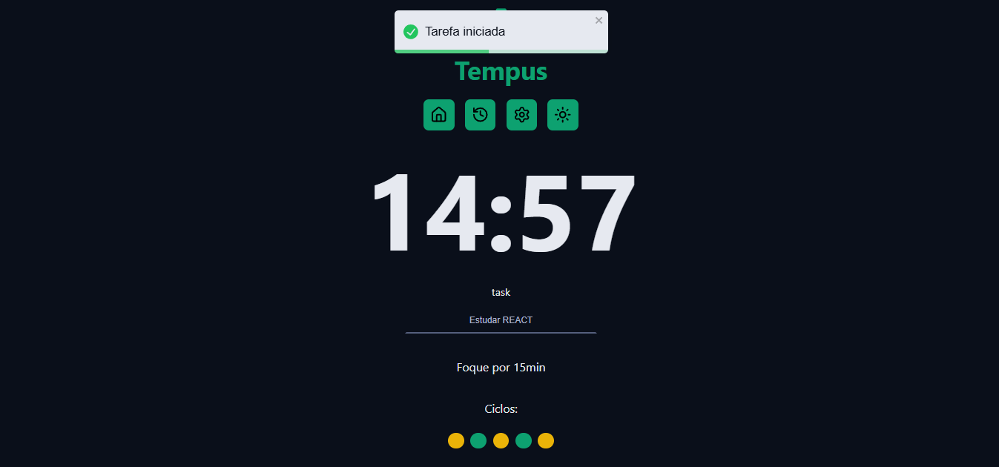

# Tempus Pomodoro

Uma implementação moderna da Técnica Pomodoro 🍅 para organizar foco e pausas de forma simples, personalizável e com histórico automático.

---

## A técnica Pomodoro 🍅

A Técnica Pomodoro é uma metodologia de produtividade criada por Francesco Cirillo. Ela consiste em dividir o trabalho em blocos de tempo (os "Pomodoros") intercalados com pausas. O objetivo é manter o foco total por um período curto e garantir descansos para evitar o cansaço mental.

### Como funciona o Pomodoro tradicional?

1. Defina uma tarefa que você deseja realizar.
2. Trabalhe nela por 25 minutos sem interrupções.
3. Faça uma pausa curta de 5 minutos.
4. A cada 4 ciclos, faça uma pausa longa (geralmente 15 a 30 minutos).

---

## O que o Tempus Pomodoro adiciona 🚀

Nosso app segue o conceito original e adiciona recursos para deixá-lo mais flexível e rastreável:

- ⚙️ Personalização do tempo: configure foco, pausa curta e pausa longa na página de configurações.
- 🔁 Ciclos organizados em sequência: cada ciclo completado adiciona automaticamente uma entrada no histórico e o app sugere o próximo ciclo.
- 📊 Histórico automático: todas as tasks com status (completa/interrompida) ficam salvas para acompanhar sua evolução.

### Padrão de ciclos do Tempus

- Ciclos ímpares: Trabalho (foco).
- Ciclos pares: Descanso curto.
- Ciclo 8: Descanso longo especial (reseta o ciclo completo).

---

## Visualização dos ciclos

Logo abaixo do cronômetro, o app mostra bolinhas coloridas representando cada ciclo:

- 🟡 Amarelo: ciclo de trabalho (foco).
- 🟢 Verde: descanso curto.
- 🔵 Azul: descanso longo (a cada 8 ciclos).

Essa visualização ajuda a saber rapidamente em que parte do fluxo você está.


---

## Histórico automático e tarefas

Quando um ciclo termina, uma nova task é registrada no histórico com seu estado (completa ou interrompida). Na tela de histórico você pode revisar seu dia e ver padrões ao longo do tempo.




---

## Configurações (personalize seus tempos)

Você pode ajustar os minutos de foco, pausa curta e pausa longa.




---

## Fluxo de uso rápido

1. Abra a página inicial.
2. Defina (ou escolha) uma tarefa.
3. Inicie o cronômetro — foque durante o tempo definido.
4. Ao término, registre a pausa curta ou longa conforme o ciclo.



---

## Por que usar o Tempus Pomodoro?

- ✅ Organize seu foco com clareza.
- ✅ Trabalhe e descanse na medida certa.
- ✅ Personalize seus próprios ciclos e tempos.
- ✅ Acompanhe seu histórico automaticamente.

Pronto pra focar? Volte para a página inicial e inicie seus Pomodoros! 🍅🚀

"Foco total, sem pressa, sem pausa, só vai!" 💪🧘‍♂️

---

## Como rodar o projeto (PowerShell — Windows)

```powershell
npm install
npm run dev
```

Para build de produção:

```powershell
npm run build
```

